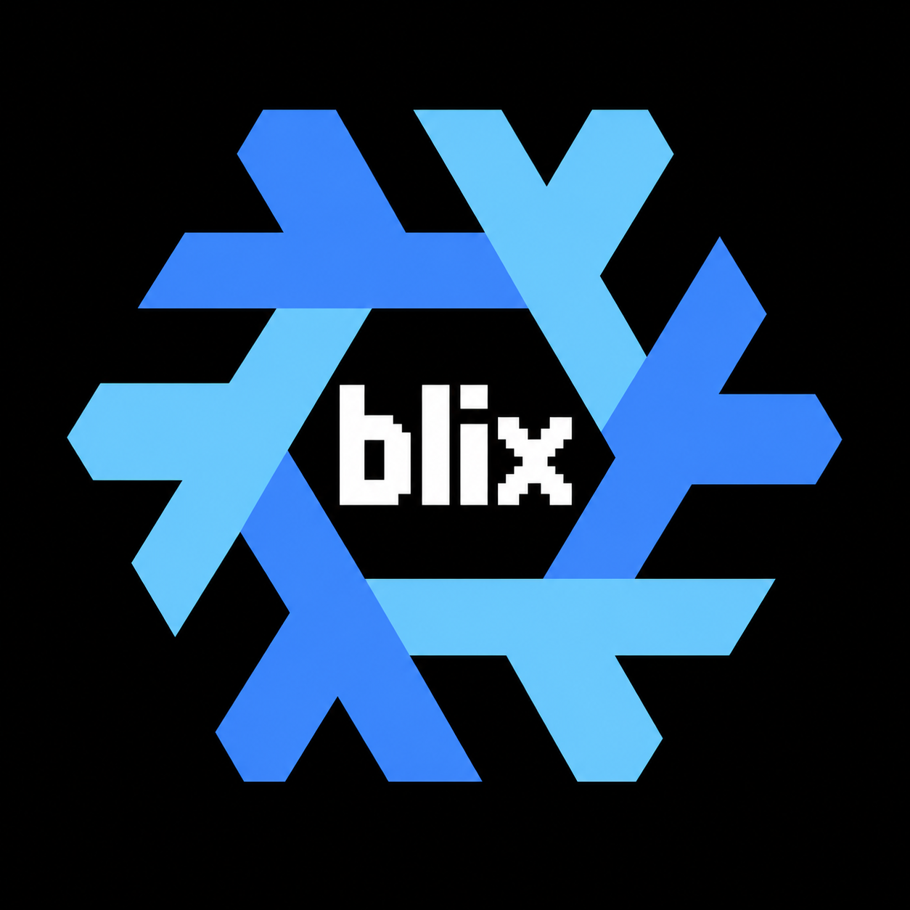

# blix

Declarative NixOS and Home Manager configuration for the `przvl` user. The
flake currently defines two hosts, `zen` and `t490`, with the same Blix-style
desktop session.

The original desktop remains available unchanged:

- Xorg is started manually with `startx`; there is no display manager.
- OXWM is the window manager, with the Blix configuration and local patches.
- `st`, `dmenu`, `picom`, `xsecurelock`, `xss-lock`, `clipmenu`, and Xfe provide
  the terminal, launcher, compositor, locking, clipboard, and file-manager
  pieces.
- Home Manager creates the user services and scripts for display hotplugging,
  locking, clipboard history, screenshots, brightness, status, and audio.
- Firefox is managed with the Blix privacy policies and force-installed uBlock
  Origin, Dark Reader, and Enhancer for YouTube extensions.

## Repository map

```text
flake.nix                         Inputs, OXWM/st overlays, and host outputs
flake.lock                        Pinned nixpkgs and Home Manager revisions

modules/common/
├── default.nix                   Shared module composition
├── boot.nix                      Shared UEFI/systemd-boot policy
├── desktop-session.nix           X11, startx, OXWM, and input behavior
├── desktop-services.nix          Graphics, PipeWire, polkit, and rtkit
├── fonts.nix                     Shared fonts
├── home-manager.nix              Shared Home Manager integration
├── locale.nix                    Locale and timezone
├── networking.nix                NetworkManager
├── nix.nix                       Nix version, flakes, GC, and optimization
├── packages.nix                  Shared system utilities
└── users.nix                     Shared user definitions

hosts/<host>/
├── default.nix                   Host composition and hardware quirks
├── hardware-configuration.nix    Generated hardware facts
└── home.nix                      Host-specific display connector settings

home/przvl/
├── default.nix                   Home Manager composition root
├── host.nix                      Typed host/display options
├── packages.nix                  Blix user packages
├── programs/                     Bash, Firefox, Git, Neovim, tmux, and tools
├── services/blix.nix              Blix session target and user services
├── scripts/blix.nix               Wrapped Blix scripts
├── x11.nix                       Dotfiles and generated ~/.xinitrc
└── config/                       OXWM, Picom, Xfe, Neovim, and script assets

packaging/
├── oxwm/                         Patches applied to the pinned OXWM release
└── st/                           Blix st configuration and patch
```

Host-specific display values live in `hosts/<host>/home.nix`. The defaults are
`eDP-1`, `HDMI-2`, `1920x1080`, and 60 Hz; change them there when a machine uses
different connector names or a different mirror mode.

## Starting the session

After logging into a TTY as `przvl`, run:

```sh
startx
```

The generated `~/.xinitrc` starts the user session target, initializes the
configured displays, starts Picom and the Blix helper services, and finally
executes OXWM. The display helper uses these environment variables, populated
from the host options:

```text
BLIX_INTERNAL_OUTPUT
BLIX_EXTERNAL_OUTPUT
BLIX_ADDITIONAL_EXTERNAL_OUTPUTS
BLIX_MIRROR_MODE
BLIX_MIRROR_RATE
```

To leave the session, exit OXWM or use the configured lock/power controls and
return to the TTY.

## Hyprland session

After activation, exit OXWM to the TTY and run `start-hyprland`. Use `startx`
for OXWM instead. Run one desktop at a time. There is no display manager or
login autostart. `Super+Shift+Q` exits Hyprland back to the TTY.

Hyprland uses dwindle tiling, the same colors, 2px borders, 8px window gaps,
and nine workspaces. Animations, blur, shadows, transparency, and idle locking
are disabled. A small Waybar shows workspaces, battery, RAM, CPU, and time;
updates use the same 5/30/60-second cadence as OXWM. Helpers run only while
Hyprland is open. This is a minimal configuration, not a measured RAM target.

Most bindings match OXWM:

| Shortcut | Action |
| --- | --- |
| Super+Enter | Foot terminal (native Wayland, matching st font/colors) |
| Super+Space / D | Fuzzel application launcher |
| Super+F / B | Xfe / managed Firefox |
| Super+1–9 / Shift+1–9 | Workspace / move window |
| Super+arrows / Shift+arrows | Cycle focus / swap windows in stack order |
| Super+Ctrl+arrows / Ctrl+Shift+arrows | Focus monitor / move window to monitor |
| Super+Tab | Previous numbered workspace, wrapping 1 to 9 |
| Super+Q / P / Shift+F | Close / float / fullscreen |
| Super+C / R / N | Master / dwindle / cycle those two layouts |
| Super+minus / equal | Adjust master factor or dwindle split |
| Super+Shift+minus / equal | Remove / add master in master layout |
| Super+V | Text clipboard history (100 entries) |
| Super+Shift+S / Print / Alt+Print | Region / full desktop / active-window screenshot |
| Super+L / Shift+Space | Lock / control menu |

Screenshots go to `~/Pictures/Screenshots` and the clipboard. Audio, media,
brightness, repeat rate, touchpad behavior, and the external Gaming Keyboard
Alt/Super swap follow OXWM. Hyprlock and Hypridle provide manual and
lock-before-suspend behavior, without idle blanking. Foot replaces st only in
Hyprland; Xfe still uses XWayland. Fuzzel lists desktop applications rather
than every executable in PATH as dmenu_run does. Hyprland layouts are native
approximations of OXWM layouts, not identical implementations.

`blix.wayland.internalOutput` and `internalScale` are typed host settings.
Zen uses the native internal-panel mode at 1.75x scale. External outputs,
including dynamically named dock outputs, mirror the internal display using
`blix.display.mirrorMode`/`mirrorRate`; differing aspect ratios may letterbox.
The wallpaper reuses `blix.display.wallpaper` (plain dark background when the
file is absent). No XRandR script or Picom runs in the Hyprland session.

Configuration lives in `home/przvl/hyprland.nix`,
`home/przvl/config/hypr/hyprland.lua`, and `home/przvl/scripts/hyprland.nix`.
The Lua syntax follows the pinned Hyprland version; see the
[upstream configuration guide](https://wiki.hypr.land/Configuring/Start/).
After changing it, also run Hyprland's `--verify-config` on the generated Lua.
For session diagnostics use `hyprctl configerrors` and
`journalctl --user -b -u 'blix-hyprland-*' -u hypridle`.

## Adding a host

1. Create `hosts/<hostname>/` and generate its hardware module with
   `nixos-generate-config --show-hardware-config`.
2. Import `../../modules/common` and the generated hardware module from the
   host's `default.nix`.
3. Set the hostname, state version, hardware quirks, and any
   host-specific networking settings there.
4. Set the display connector and mirror values in `home.nix`.
5. Register the host in `flake.nix`:

```nix
nixosConfigurations = {
  zen = mkHost { modules = [ ./hosts/zen ]; };
  t490 = mkHost { modules = [ ./hosts/t490 ]; };
};
```

## Updating inputs and Nix

The flake follows `nixpkgs/nixos-unstable` and Home Manager follows the locked
nixpkgs revision. The common Nix module selects `pkgs.nixVersions.latest`, so
the rebuilt system uses the newest Nix package supplied by the locked nixpkgs
revision. Refresh and review the lockfile with:

```sh
nix flake update
nix eval .#nixosConfigurations.zen.config.nix.package.version --raw
```

Codex comes from the [SecBear/codex-nix](https://github.com/SecBear/codex-nix)
overlay, which packages official upstream binaries and checks for stable
releases hourly. The same `nix flake update` refreshes this input; no manual
Codex version or hash edits are needed. Availability depends on the upstream
update workflow completing. The lockfile pins the resulting revision, and a
rebuild installs it. This adds a third-party packaging source, without adding
a binary cache or running a standalone installer.

The OXWM overlay pins upstream OXWM 0.13.0 and carries the two Blix patches;
the `st-blix` overlay applies the local `st` configuration and scrollback/
URL patch.

## Validation

Evaluate every host and run the full closure builds before activation:

```sh
nix flake check
nix eval .#nixosConfigurations.zen.config.system.build.toplevel.drvPath --raw
nix eval .#nixosConfigurations.t490.config.system.build.toplevel.drvPath --raw
nix build .#nixosConfigurations.zen.config.system.build.toplevel --no-link
nix build .#nixosConfigurations.t490.config.system.build.toplevel --no-link
```

Only after those checks succeed should a host be activated:

```sh
sudo nixos-rebuild switch --flake .#zen
```
