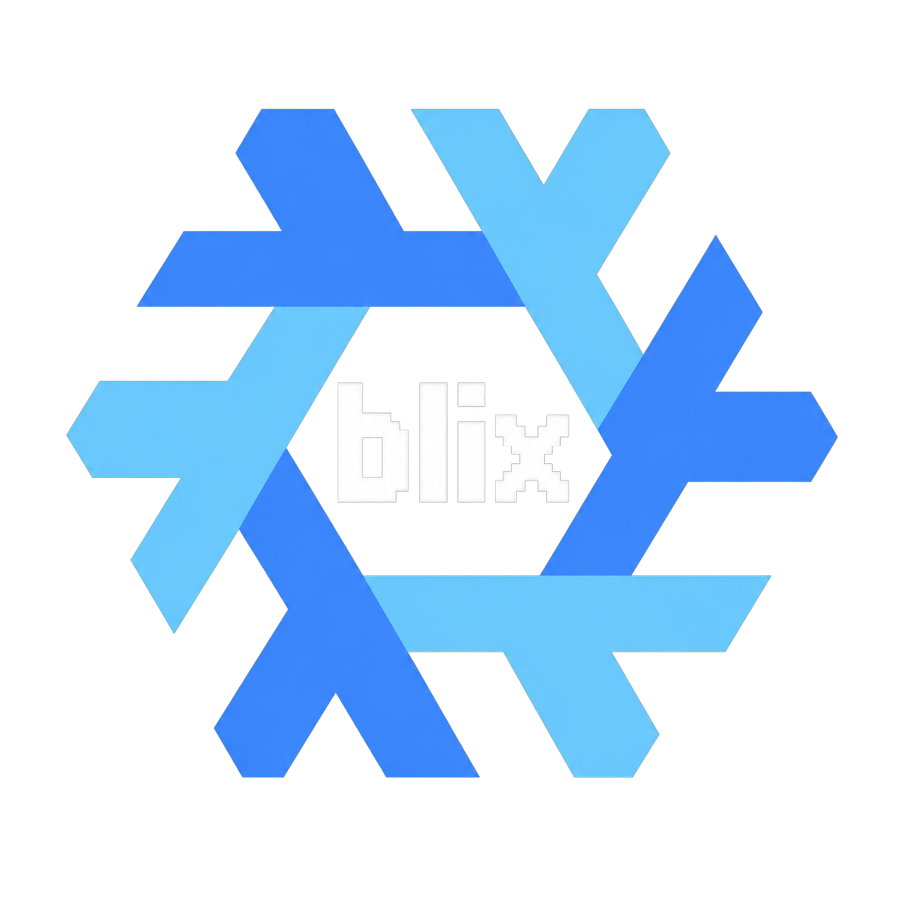

<p align="center">
  
</p>

# blix

Declarative NixOS and Home Manager configuration for the `przvl` user. The
flake defines `zen`, `t490`, and a prepared OnePlus 6T `phone`, with the same
Blix-style OXWM desktop session. The phone has not yet been physically boot-tested.
Its independent user composition lets its applications and environment evolve
separately from the workstations.

The desktop uses:

- Xorg is started manually with `startx`; there is no display manager.
- OXWM is the window manager, with the Blix configuration and local patches.
- Ghostty, `dmenu`, `picom`, `xsecurelock`, `xss-lock`, `clipmenu`, and Xfe provide
  the terminal, launcher, compositor, locking, clipboard, and file-manager
  pieces.
- Ghostty runs Bash with ble.sh for interactive editing, highlighting and
  completion. Home Manager manages its settings and Bash integration; OXWM's
  terminal binding uses the same executable as `$TERMINAL`.
  Clicking within the current shell command moves the editing cursor there.
  Ctrl-click opens links in Firefox; use Ctrl-Shift-click when a terminal
  application captures the mouse.
- Home Manager creates the user services and scripts for display hotplugging,
  locking, clipboard history, screenshots, brightness, status, and audio.
- Blix Settings is a native GTK app for display, audio, Bluetooth, networking,
  power and input controls. `Super+S` opens or focuses its window.
- Firefox is managed with the Blix privacy policies and force-installed uBlock
  Origin, Dark Reader, and Enhancer for YouTube extensions. Its default profile
  includes the captured privacy preferences, vertical tabs, square corners,
  JetBrains Mono fonts, and dark PDF pages.
- Neovim uses LazyVim with the minimal theme. `nvimide [project-directory]`
  adds a left explorer and two stacked terminals on the right, with Neofetch
  in the second terminal. Plain `nvim` keeps the normal editor layout.
- tmux is installed with its upstream defaults, without a Blix configuration
  or custom layout launcher.

Firefox and Neovim configuration lives in `home/przvl/config/`; the application
modules own the Home Manager integration for these local files.
The Neovim adapter uses Nix-packaged Lua language server, StyLua and shfmt in
place of Mason downloads, and preserves the writable lazy.nvim lockfile.

## Repository map

```text
flake.nix                         Inputs, host composition, and checks
flake.lock                        Pinned nixpkgs, Home Manager, Codex and Mobile NixOS
lib/mk-host.nix                   Platform, overlays, and Home Manager wiring
overlays/desktop.nix              OXWM patches and the Neofetch package
overlays/codex.nix                Complete Codex runtime packaging

profiles/
├── laptop.nix                    Shared workstation environment and laptop defaults
├── desktop.nix                   Shared workstation environment and desktop defaults
└── phone.nix                     Independent phone system and user composition

modules/boot/uefi.nix             Optional UEFI/systemd-boot defaults

modules/common/
├── default.nix                   Shared foundation without a desktop environment
├── boot.nix                      Bootloader-independent kernel policy
├── home-manager.nix              Home Manager wiring and shared user identity
├── locale.nix                    Locale and timezone
├── machine.nix                   Typed capabilities and Home Manager bridge
├── networking.nix                NetworkManager
├── nix.nix                       Nix version, flakes, GC, and optimization
├── packages.nix                  Shared system utilities
└── users.nix                     Shared user definitions

modules/desktop/
├── default.nix                   Optional desktop environment composition
├── session.nix                   X11, startx, and OXWM
├── services.nix                  Graphics, PipeWire, polkit, rtkit, and Blueman
├── fonts.nix                     Desktop fonts
└── packages.nix                  X11 utilities and graphics diagnostics

modules/hardware/
├── default.nix                   Session-independent Bluetooth and power policy
├── x11.nix                       Desktop input module composition
├── keyboard.nix                  Keyboard layout and repeat defaults
├── keyboards/mechanical.nix      Device-specific Cmd/Super mapping
├── mouse.nix                     Natural scrolling for ordinary mice
├── touchpad.nix                  Natural scrolling and click/tap defaults
├── power.nix                     Capability-based lid policy
└── bluetooth.nix                 Capability-based Bluetooth support

hosts/<host>/
├── default.nix                   Profile inheritance and hardware quirks
├── hardware-configuration.nix    Generated hardware facts
├── home.nix                      Machine-dependent Home Manager composition
└── display.nix                   Host display connectors and scaling

hosts/phone/
├── default.nix                   ARM fajita host selecting the normal phone profile
├── hardware.nix                  Mobile NixOS hardware, boot, firmware and rootfs
├── bootstrap.nix                 Temporary USB networking and key-only SSH
├── bootstrap.pub                 Public key for temporary installation access
├── bootstrap-system.nix          Small installation userspace, without the desktop
├── home.nix                      Machine-dependent user composition
└── display.nix                   Runtime panel discovery until physically verified

home/przvl/
├── base.nix                      Shared identity, state version and capabilities
├── default.nix                   Workstation user composition for zen and t490
├── phone.nix                     Independent phone application and session choices
├── environments/oxwm.nix         Reusable OXWM services, helpers and settings
├── hardware/
│   ├── default.nix               Typed user capabilities
│   ├── bluetooth.nix             Bluetooth manager and session pairing agent
│   ├── display.nix               Display options, helper package and service
│   └── display-hotplug.sh        Mirroring, extension and reconnect behavior
├── packages.nix                  Reusable command-line package selection
├── programs/                     Bash, Firefox, Git, Neovim, tmux, and tools
├── services/blix.nix              Blix session target and user services
├── scripts/blix.nix               Wrapped Blix scripts
├── x11.nix                       Dotfiles and generated ~/.xinitrc
└── config/                       OXWM, Picom, Xfe, Neovim, and script assets

packaging/
├── blix-settings/                Native settings app, backends and GTK styling
├── oxwm/                         Patches applied to the pinned OXWM release
└── neofetch/                     Pinned Neofetch and NixOS compatibility fixes

tests/
├── default.nix                   Checks for x86_64-linux and aarch64-linux
├── profile-fixture.nix           Synthetic hardware for evaluation/build checks
├── machine-profiles.nix          Profile defaults and hardware overrides
├── environment-composition.nix   Shared foundation and phone environment replacement
├── phone-hardware.nix            Real fajita/bootstrap integration assertions
├── keyboard-mapping.nix          Compiled built-in and mechanical keymaps
├── keyboard-mapping.py           Win/Cmd modifier regression checks
├── display-hotplug.py            Monitor, rotation, scaling, and reconnect checks
├── blix-settings.nix             Settings backend and isolated GTK checks
└── session-settings.nix          Generated blanking and Xresources behavior
```

## Machine profiles

Each host imports a profile from `profiles/`, plus its hardware module. Every
profile includes `modules/common`; hosts do not need to import it separately.
The common foundation selects no desktop, GUI applications, display connector,
or user-session services. Profiles explicitly choose their system environment
and Home Manager composition.

`zen` and `t490` inherit the laptop profile and share `home/przvl/default.nix`.
The desktop profile uses that workstation composition too. The phone profile
selects `home/przvl/phone.nix`, which chooses reusable application modules
individually and does not import the workstation composition. All three profiles
currently opt into `modules/desktop` and `home/przvl/environments/oxwm.nix` to
preserve the existing environment. Profiles supply defaults, shared modules
implement capability-based behavior, and hosts supply facts and exceptions.

| Default | Laptop | Desktop | Phone |
| --- | --- | --- | --- |
| `blix.machine.type` | `"laptop"` | `"desktop"` | `"phone"` |
| `hasBattery`, `hasBacklight` | `true` | `false` | `true` |
| `hasTouchpad`, `hasLid` | `true` | `false` | `false` |
| `hasBluetooth` | `true` | `false` | `true` |
| Lid close, on battery or external power | Suspend | Ignore | Ignore |
| Lid close while docked | Ignore | Ignore | Ignore |
| `blix.display.layout` | `"mirror"` | `"extend"` | `"extend"` |
| `blix.display.blankAfterSeconds` | `0` | `0` | `300` |
| Boot provider | UEFI/systemd-boot | UEFI/systemd-boot | Supplied by hardware layer |

Capabilities are typed NixOS options under `blix.machine` and can be overridden
in `hosts/<host>/default.nix`. For example, a laptop without a controllable
panel backlight can set `blix.machine.hasBacklight = false`. The system passes
battery and backlight capabilities to Home Manager automatically. Desktop
profiles omit battery widgets, Neofetch battery reporting, and battery/brightness
helpers; brightness bindings are only registered when a backlight is enabled. Battery
reporting still checks for actual hardware at session startup. Lid behavior
uses `hasLid`, independently of the profile's name. Bluetooth support enables
BlueZ and powers the controller on at boot. The selected desktop supplies Blueman
and the user session supplies its pairing agent.
The Blueman pairing agent starts with the Blix X11 session without requiring a
system tray. Launch `blueman-manager` from dmenu or a terminal to pair, trust and
connect devices. Pairing records stay on the machine; hosts can opt out with
`blix.machine.hasBluetooth = false`.

Charge thresholds, Wi-Fi power quirks, and panel-driver workarounds remain
host-specific. The profiles share manual suspend and locking before suspend.
The phone profile also enables zram and UPower, requests orderly shutdown at 3%
battery, and makes a short power-button press lock the session. Automatic
suspend is left to verified host policy. Hosts can override individual logind
defaults through `services.logind.settings.Login`.

Keyboard, mouse, touchpad, lid and Bluetooth policy live in separate files under
`modules/hardware/`. Natural scrolling applies to ordinary mice and all touchpads,
including external touchpads on desktop and phone hosts using the X11 environment.
The shared foundation includes only power and Bluetooth policy; the desktop
selects keyboard, mouse and touchpad policy through `modules/hardware/x11.nix`.
Pointing sticks and tablets retain their existing behavior. `hasTouchpad` enables
the additional tap and click defaults; scrolling can be overridden with
`services.libinput.touchpad.naturalScrolling`.

`keyboards/mechanical.nix` matches USB ID `1fc9:e8c7` and swaps Alt/Super for that
keyboard's Mac-mode Cmd key. Built-in laptop Win keys retain Super. Xorg applies
the rule when the device connects; no keyboard hotplug daemon or Xorg log parsing
is needed. New device-specific mappings belong alongside that module.

Display behavior and its dedicated hotplug service live in
`home/przvl/hardware/display.nix` and `display-hotplug.sh`. Display facts live in
`hosts/<host>/display.nix`, imported by the host's `home.nix`. Each host using the
X11 environment supplies `blix.display.primaryOutput`: an internal connector such
as `eDP-1` on a laptop, or a monitor connector such as `DP-1` on a desktop. Extended
layouts use preferred modes and place other connected monitors to the right of the
primary monitor. Mirrored layouts use `externalOutput` and
`additionalExternalOutputs`, with `mirrorMode` defaulting to `1920x1080`.
For each display, the helper selects the highest advertised refresh rate at the
chosen resolution: the preferred resolution for extended/undocked displays,
and `mirrorMode` for mirrored displays. Rates are selected independently, so a
slower monitor does not impose its rate on the others. `mirrorRate` defaults to
`null` for automatic selection; setting a value such as `"60"` explicitly pins
mirrored rates. If a driver rejects a selected rate, the helper retries the same
resolution with automatic refresh selection. It reapplies newly advertised
rates while ignoring duplicate events and changes to the active-mode marker.
`primaryScaleFrom` optionally sets a logical resolution
for the primary display outside mirrored operation. Hosts can override the
inherited layout, so a laptop can use extended monitors too.

`primaryRotation` accepts `"normal"`, `"left"`, `"right"`, or `"inverted"`.
Rotation is reapplied on startup and reconnect. `dpi` optionally sets X11,
Xft and GTK font/UI sizing; it defaults to `null` so existing hosts retain
their current sizing. Font changes may require restarting applications.
Rotation and DPI are host facts, rather than assumptions in the phone profile.
`primaryOutput = null` selects the first connected output at runtime. The
prepared phone uses this until its XRandR connector has been observed; explicit
connectors on the existing workstations retain their usual behavior.
`blankAfterSeconds` controls idle DPMS display power-off; `0` disables it.

A desktop's `display.nix` can be as small as:

```nix
{ ... }:
{
  blix.display.primaryOutput = "DP-1";
}
```

## Blix Settings

Open `blix-settings` from a terminal or launcher, or press `Super+S`. The app
uses the existing NetworkManager, BlueZ, PipeWire/PulseAudio and X11 services;
it also includes a searchable shortcut reference and system information.

- Display controls cover mirror/extend layouts, monitor positions, resolutions,
  each output's advertised refresh rates, rotation, scaling and brightness.
  Applying a layout starts a 15-second confirmation window. A separate watchdog
  restores the previous layout if it is rejected, times out or the app closes.
- Audio controls select speakers and microphones, adjust volume and mute,
  play a test tone, and show an optional microphone level meter without recording.
- Bluetooth supports discovery, pairing confirmation, connection and forgetting
  devices. Networking supports Wi-Fi passwords, saved profiles and Ethernet
  status. Advanced Connections opens NetworkManager's editor for VPNs,
  enterprise authentication and detailed connection settings.
- Power shows battery and charge-limit information, configures display idle
  time, and offers locking and suspend. Input controls configure pointing-device
  speed, natural scrolling, touchpad tapping and keyboard repeat.

Nix supplies immutable, capability-based defaults in `~/.config/blix/defaults.json`.
User choices live separately in `~/.config/blix/settings.json`; Restore Defaults
removes the corresponding override. Display preferences are reapplied by the
existing hotplug helper, and saved input preferences return when matching
devices reconnect. NetworkManager owns Wi-Fi credentials and connection profiles;
BlueZ owns pairing records. Neither is copied into the settings file.

`blix-settings --demo` previews the interface with sample devices and in-memory
preferences. It does not change hardware or saved settings.

## Starting the session

After logging into a TTY as `przvl`, run:

```sh
startx
```

The generated `~/.xinitrc` starts the user session target, initializes the
configured displays, starts Picom and the Blix helper services, and finally
executes OXWM. The display helper uses these environment variables, populated
from the host options:

```text
BLIX_DISPLAY_LAYOUT
BLIX_PRIMARY_OUTPUT
BLIX_PRIMARY_ROTATION
BLIX_DISPLAY_DPI
BLIX_EXTERNAL_OUTPUT
BLIX_ADDITIONAL_EXTERNAL_OUTPUTS
BLIX_MIRROR_MODE
BLIX_MIRROR_RATE
BLIX_PRIMARY_SCALE_FROM
BLIX_WALLPAPER
```

Firefox's local Blix Video Opacity extension marks a window's title with
`[blix-video]` while its active tab plays an HTML video, including embedded
videos and private windows. Picom makes only marked Firefox windows opaque;
pause, completion, navigation and tab switching restore ordinary transparency.
Tabs on x.com and its subdomains keep ordinary transparency, including when
they play videos in embedded frames. The detector also skips x.com documents.
The extension uses playback events and an idle-unloading background page, with
no polling or separate service. Shared Home Manager configuration loads its
immutable Nix package as a trusted built-in through Firefox AutoConfig; normal
addon signature checks and the web-content sandbox remain enabled. Its sources
live in `home/przvl/config/firefox/video-opacity/`; bump `manifest.json`'s version
when updating it. The isolated `firefox-video-opacity` check exercises playback,
window/tab/frame lifecycle, browser restarts and Picom's rendered opacity.

To leave the session, exit OXWM or use the configured lock/power controls and
return to the TTY.

## Adding a host

1. Create `hosts/<hostname>/` and generate its hardware module with
   `nixos-generate-config --show-hardware-config`.
2. Import the appropriate laptop, desktop, or phone profile and the hardware
   module from the host's `default.nix`. Supply any additional boot provider.
3. Set the hostname, the state version of that machine's installation, hardware
   quirks, capability overrides, and host-specific networking settings there.
   Connect its `home.nix` with `home-manager.users.przvl = import ./home.nix;`.
4. For the X11 environment, set `blix.display.primaryOutput` and any other display
   values in `display.nix`, and import that file from `home.nix`.
5. Register the host in `flake.nix`:

```nix
nixosConfigurations = {
  zen = mkHost { modules = [ ./hosts/zen ]; };
  t490 = mkHost { modules = [ ./hosts/t490 ]; };
};
```

An ARM host sets `system = "aarch64-linux"` in `mkHost`. The real phone also
passes `specialArgs = { inherit mobile-nixos; };` to its hardware module.
Profiles choose capabilities; the host constructor chooses the package platform.

## Phone preparation

`profiles/phone.nix` owns phone system policy and chooses its system environment.
`home/przvl/phone.nix` independently selects phone applications, reusable program
configuration and user-session modules. The initial selection retains OXWM,
Xorg, Ghostty, dmenu, Firefox and Neovim. Workstation application additions in
`home/przvl/default.nix` or `home/przvl/programs/default.nix` do not automatically
reach the phone. Changes to an individual reusable program module still affect
every composition that imports it.

Put phone-specific applications and user behavior in `home/przvl/phone.nix` or
focused modules it imports. It can omit shared command-line packages or choose
different program modules without replacing the workstation's package list.
For a different session, replace the `modules/desktop` import in the phone system
profile and the `environments/oxwm.nix` import and desktop-specific application
and appearance modules in the phone user composition together. Replace X11-specific
display settings such as `blix.display.blankAfterSeconds` as part of that change.
The shared foundation remains usable without X11, a display connector or Blix
user services.

The profile selects no architecture, kernel, firmware, bootloader, partition
layout, display connector or rotation. `hosts/phone/hardware.nix` imports the
locked Mobile NixOS `oneplus-fajita` device layer; `flake.nix` selects
`aarch64-linux`. This is regular NixOS userspace with a device-specific kernel
and first-stage boot implementation. No Phoneputer desktop configuration,
GNOME, Phosh, Plasma Mobile or Ubuntu Touch environment is imported.

This preparation follows [Phoneputer](https://github.com/mwlaboratories/phoneputer),
the [6T fork](https://github.com/rinnvxv/phoneputer), and
[upstream fajita support](https://mobile.nixos.org/devices/oneplus-fajita.html).
The lock pins Mobile NixOS at `2c132754323fc1915e8d21dcfc0ef68ab084c6fb`,
which still selects the SDM845 `6.4.0` kernel and declares best-effort support.
The fork's examples use GNOME/PulseAudio and a default root password; its README
and `local.nix` disagree on that password. They are references for the hardware
workflow, not configurations to copy into Blix. Existing Blix inputs retain
their revisions; Phoneputer itself is not a build dependency.

| Boundary | Prepared phone configuration |
| --- | --- |
| Bootloader | Android A/B boot image; no GRUB, UEFI or systemd-boot. An external loader hook reports that boot partitions are managed separately. |
| Kernel and initrd | Upstream SDM845 kernel and Mobile stage-1. No PC kernel modules or generated laptop hardware file. No stage-0/kexec support. |
| Firmware | Upstream OnePlus firmware and Qualcomm support services. Only the OnePlus firmware package and its zstd wrapper are permitted as unfree. |
| Filesystem | Generated ext4 image labeled `NIXOS_SYSTEM`, intended for existing `userdata`. No invented UUID or `/boot`. Filesystem auto-resize is enabled; GPT/partition growth is disabled. |
| Audio | Blix PipeWire/Pulse compatibility and upstream SDM845 ALSA UCM data. Hardware routing and volume remain to be tested. |
| Networking | Ordinary NetworkManager. The temporary USB profile is in `bootstrap.nix`; no competing wireless daemon, stage-2 phone DHCP server or embedded Wi-Fi password. |
| Bluetooth and input | BlueZ, Blix's Blueman pairing agent, and touchpad defaults for the folding keyboard. Pairing state stays on the phone; mechanical USB key remapping does not apply to Bluetooth. |
| Graphics | Ordinary Xorg/Mesa/OXWM. Discover the first connected output until on-device XRandR, rotation, DPI and acceleration are verified. |
| Users | Shared `przvl` identity and Home Manager state `26.05`; new system installation state `26.11`. Local passwords must be set at first boot. |

The synthetic `checks.aarch64-linux.phone-system` still uses fake storage and
UEFI solely for composition tests. **Never flash or activate that fixture.**
Use the actual phone outputs below. Evaluation, successful builds, and the
`phone-hardware` assertions do not establish that this physical 6T will boot.

### Build before device preparation

From this repository on the T490, inspect the connected device with pinned tools:

```sh
nix shell --inputs-from . nixpkgs#android-tools nixpkgs#usbutils
lsusb
adb devices -l
fastboot devices
```

On 2026-10-08 the host sees OnePlus USB `2a70:f003`, presenting MTP and mass
storage, with no ADB interface. Both device listings are empty. Its firmware,
bootloader lock state, exact variant, A/B slot state and partition sizes have
not been verified. A powered phone and successful USB enumeration do not imply
that USB debugging or fastboot is available. This phase does not reboot it.

Evaluate the actual host and build the small cross-compiled installation image:

```sh
nix eval .#nixosConfigurations.phone.config.system.build.toplevel.drvPath --raw
nix build .#packages.x86_64-linux.phone-bootstrap-images --out-link result-phone-bootstrap
ls -lh result-phone-bootstrap/
sha256sum result-phone-bootstrap/boot.img result-phone-bootstrap/system.img
sed -n '1,200p' result-phone-bootstrap/flash-critical.sh
```

The final command **reads** the generated script; do not execute it. The script
writes both boot slots. The small bootstrap replaces the profile's desktop and
phone application composition and extra CLI/documentation packages while
keeping the shared foundation, real device layer, `przvl` user, Git, Nix,
NetworkManager and temporary SSH. It is not the final
Blix desktop. Cross-compilation may expose package/build incompatibilities even
when evaluation succeeds; do not proceed with an incomplete build.

On an ARM machine, or from a machine with a configured ARM builder, build the
native bootstrap and full phone closure/images with:

```sh
nix build .#packages.aarch64-linux.phone-bootstrap-images --out-link result-phone-bootstrap-native
nix build .#nixosConfigurations.phone.config.system.build.toplevel --no-link
nix build .#packages.aarch64-linux.phone-fastboot-images --out-link result-phone
```

The T490 currently has no ARM builder or emulation. The x86 bootstrap output
uses an x86 builder to cross-compile ARM code; the full desktop output requires
an ARM builder. Both use the same locked nixpkgs and Mobile NixOS inputs.

### Device inspection and approval gate

Before changing anything on the phone, establish an authorized ADB connection
and record these read-only facts when available:

```sh
adb -d shell getprop ro.product.device
adb -d shell getprop ro.product.model
adb -d shell getprop ro.build.display.id
adb -d shell getprop ro.build.version.release
adb -d shell getprop ro.boot.flash.locked
adb -d shell getprop ro.boot.slot_suffix
adb -d shell getprop ro.boot.verifiedbootstate
adb -d shell cat /proc/partitions
```

When the user has separately placed the phone in its bootloader, read:

```sh
fastboot getvar product
fastboot getvar unlocked
fastboot getvar current-slot
fastboot getvar slot-unbootable:a
fastboot getvar slot-unbootable:b
fastboot getvar partition-size:boot_a
fastboot getvar partition-size:boot_b
fastboot getvar partition-size:userdata
```

Verify the actual fajita variant, backup/restore plan, bootloader eligibility,
image sizes/checksums, and the OxygenOS 11 and consistent A/B firmware
prerequisites in upstream's device notes. Do not substitute an enchilada image.
Unlocking, firmware updates, recovery sideloads and `copy-partitions` payloads
are separate operations that need their own explicit approval. An installation
guide or a generated script does not grant that approval.

After those facts and a complete image build are reviewed, the upstream
mainline-only sequence would include these **proposed, unexecuted** operations:

```sh
fastboot erase dtbo_a
fastboot erase dtbo_b
fastboot --slot=all flash boot result-phone-bootstrap/boot.img
fastboot flash userdata result-phone-bootstrap/system.img
```

**Stop before each device-writing step and obtain approval for its exact
command.** Flashing `userdata` replaces Android user data with the rootfs; the
image resizes that filesystem within its existing partition on first boot.
Upstream boot-control also marks successful A/B boots in device metadata.
Do not run a flashing script, reformat/erase userdata redundantly, modify the
GPT layout, or sideload a partition-writing ZIP automatically. Rebooting and
the first boot are a later, explicitly authorized device-preparation phase.

### USB bootstrap and ordinary Blix deployment

`bootstrap.nix` enables USB networking in stage-1 and a NetworkManager manual
profile on the expected phone interface `usb0` in stage-2. The phone uses
`172.16.42.1/24`, with the computer at `172.16.42.2` as its temporary gateway.
Public DNS is queried through the computer's NAT. The route/DNS priorities let
ordinary Wi-Fi take precedence. Stage-1 SSH remains disabled because upstream
would otherwise allow unauthenticated root access.

The temporary stage-2 SSH server listens only on `172.16.42.1`, permits keys
for `root` and `przvl`, disables password/keyboard-interactive authentication,
and opens port 22 only on `usb0`. `bootstrap.pub` contains the existing local
ED25519 public key with fingerprint
`SHA256:Y/8PcF46sChrXneDtAzL7aj44MCOPy13Rlv/Hxi2FsA`; no private key is needed
on the phone. Confirm that the corresponding private key is available on the
computer before installing the image. There is no preset login password.

After an approved installation and boot, identify the **new, observed** USB
network interface on the T490 with `ip -brief link`. Then create a reversible,
temporary NetworkManager connection; replace the interface placeholder:

```sh
PHONE_USB_IFACE='<observed USB network interface>'
nmcli connection add type ethernet ifname "$PHONE_USB_IFACE" con-name blix-phone-bootstrap \
  ipv4.method shared ipv4.addresses 172.16.42.2/24 ipv4.never-default yes \
  ipv6.method disabled connection.autoconnect no
nmcli connection up blix-phone-bootstrap
ssh root@172.16.42.1
```

NetworkManager's shared mode supplies NAT to the computer's existing uplink.
Confirm the USB address and Internet access before a rebuild; if the expected
phone interface differs, correct `bootstrap.nix` and rebuild the image before
installation. There is no permanent forwarding/firewall change to the T490 or
zen configuration. Delete the host connection afterward with
`nmcli connection delete blix-phone-bootstrap`.

On the phone, set `przvl`'s local password with `passwd przvl`, then pair/trust
the Bluetooth keyboard and touchpad with
`bluetoothctl`. Wi-Fi can be configured with NetworkManager's interactive
`nmcli --ask device wifi connect '<SSID>'`; keep credentials out of the flake.
From the initial root SSH session, clone the repository as `przvl`:

```sh
sudo -u przvl git clone https://github.com/blakepiper/blix.git /home/przvl/blix
```

Blix's normal Git
configuration rewrites GitHub HTTPS URLs to SSH after the full switch; install
the user's normal GitHub access or disable that rewrite on the phone before
subsequent pulls.

After evaluating/building on the phone, the intended ordinary command is:

```sh
cd /home/przvl/blix
sudo nixos-rebuild switch --flake .#phone
```

Log into a **local TTY** as `przvl` using the paired keyboard and run `startx`.
An SSH shell is not a local seat for Blix's manual session. Record the actual
`xrandr --query` connector, choose landscape rotation/DPI in
`hosts/phone/display.nix`, and verify acceleration, Bluetooth reconnect,
brightness, charging, audio routing/volume, locking, and suspend/resume. A
successful switch does not verify the next reboot; test it as a separate step.

Before removing the `./bootstrap.nix` import from `hosts/phone/default.nix`, set
normal local credentials and verify a replacement management connection in a
second session. Remove the temporary NetworkManager profile from the running
phone when safe; removing its declarative definition alone does not disconnect
an already active connection. The bootstrap system/image can then be retired.

### Kernel and boot-image updates

Mobile NixOS's fajita bootloader cannot switch to a generation's kernel through
kexec. Its flashed stage-1 selects the NixOS userspace generation from the
rootfs, but ordinary `nixos-rebuild switch` does not install a new `boot.img`.
Userspace changes can use the normal command above while the installed kernel,
initrd, device firmware and boot parameters remain compatible.

For a kernel, stage-1, device-tree or boot-parameter change, build
`packages.aarch64-linux.phone-boot-image`, review its relation to the selected
system generation and the known working image, then stop for separate approval
of the exact boot-partition update. Keep a known working boot image and rootfs
generation for recovery. Do not reflash `system.img` during routine updates:
that would overwrite the phone's persistent rootfs and user state.

## Updating inputs and Nix

The flake follows `nixpkgs/nixos-unstable` and Home Manager follows the locked
nixpkgs revision. The common Nix module selects `pkgs.nixVersions.latest`, so
the rebuilt system uses the newest Nix package supplied by the locked nixpkgs
revision. Refresh and review the lockfile with:

```sh
nix flake update
nix eval .#nixosConfigurations.zen.config.nix.package.version --raw
```

Codex comes from the [SecBear/codex-nix](https://github.com/SecBear/codex-nix)
overlay, which packages official upstream binaries and checks for stable
releases hourly. The same `nix flake update` refreshes this input; no manual
Codex version or hash edits are needed. Availability depends on the upstream
update workflow completing. The lockfile pins the resulting revision, and a
rebuild installs it. This adds a third-party packaging source, without adding
a binary cache or running a standalone installer.

`overlays/codex.nix` completes the binary package with the manifest, ripgrep,
and bubblewrap needed by Codex's background server. The helper binaries are
static and copied into the package because the daemon copies its installation
and rejects links outside the package. Codex still takes its version and
binary hashes from the locked `codex-nix` input. When checking an update, test
ordinary `codex` startup: `codex --version` and `codex --no-daemon` do not
exercise background-server installation.

Ghostty comes from nixpkgs; the current lock supplies 1.3.1, the
[latest stable release](https://ghostty.org/download) checked on 2026-10-06.
Updating nixpkgs refreshes Ghostty along with the other distribution packages.
`packaging/ghostty/` backports the upstream Bash/ble.sh prompt fix to the
integration script while the terminal executable stays cached.
The wrapper preserves automatic shell integration and supplies `xdg-open` for
links; Firefox is also exported as the session's browser.
Neofetch uses its built-in NixOS logo.
The OXWM overlay pins upstream OXWM 0.13.0 and applies the Blix keyboard, monitor,
bar and tiling patches in `packaging/oxwm/`.
`packaging/neofetch/` retains the original Neofetch package with its NixOS fixes.
Its settings and ASCII layout are local assets under `home/przvl/config/neofetch/`.

## Validation

`nix flake check` evaluates laptop, desktop and ARM phone profile fixtures,
including a phone that replaces the default system and user environment while
retaining phone power policy and shared identity. It checks generated user
configuration and overrides, compiles keyboard mappings, and runs display
hotplug regression checks. The ARM evaluation runs even on an x86 machine.

When intentionally changing the phone environment, update its fixture settings
and expectations in `tests/`, including `machine-profiles.nix` and
`session-settings.nix`. Keep the shared-foundation and environment-replacement
checks in `environment-composition.nix`.

Evaluate every host and run the full closure builds before activation:

```sh
nix flake check
nix flake check --all-systems --no-build
nix eval .#nixosConfigurations.zen.config.system.build.toplevel.drvPath --raw
nix eval .#nixosConfigurations.t490.config.system.build.toplevel.drvPath --raw
nix build .#nixosConfigurations.zen.config.system.build.toplevel --no-link
nix build .#nixosConfigurations.t490.config.system.build.toplevel --no-link
```

With an ARM machine or an aarch64 builder configured, realize the full synthetic
phone system to check the desktop and package closure:

```sh
nix build .#checks.aarch64-linux.phone-system --no-link
```

Evaluation does not require an ARM builder. Native ARM builds do; an x86
machine needs a remote ARM builder or configured emulation. Building this
fixture checks userspace composition and does not establish fajita boot support.

Only after those checks succeed should a host be activated:

```sh
sudo nixos-rebuild switch --flake .#zen
```
